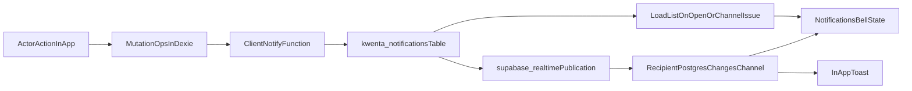

# In-App Realtime Notification Audit

## Goal and Scope

This audit reviews whether the current notification system meets the expected **in-app realtime** behavior:

- Recipient sees new notifications while online and inside the app, without manual refresh.
- No background/mobile push assumptions (app closed is out of scope for this phase).

## Current Architecture (As Implemented)

### Core flow

- Notification rows are inserted into `kwenta_notifications` from client helpers in `src/lib/kwenta-notifications.ts`.
- Recipients subscribe in `src/components/notifications/NotificationsBell.tsx` via `supabase.channel(...).on('postgres_changes', ...)`.
- Badge/list state is local React state with unread cache in `localStorage`.
- Realtime publication for notifications is enabled by `supabase/migrations/018_enable_realtime_kwenta_notifications.sql`.

### Data and policy layer

- Notification table and RLS policies are defined in `supabase/migrations/009_kwenta_notifications.sql`.
- Notification kinds are extended in `015_kwenta_notifications_payment_recorded.sql` and `016_kwenta_notifications_added_to_group.sql`.
- Recipient delete policy and cleanup triggers are in `020_notification_delete_and_cleanup.sql`.

## Trigger Coverage (Current State)

Current notification inserts are called from `src/db/operations.ts`:

- `createBill` -> `notifyBillParticipantsCreated`
- `addGroupMember` and `addExistingGroupMember` -> `notifyAddedToGroup`
- `linkProfileToRemote` -> `notifyProfileLinked`
- `createSettlement` -> `notifyPaymentRecorded`

Not currently notifying:

- `updateBill`, `deleteBill`
- `removeGroupMember`, `deleteGroup`, `updateGroup`
- `updateSettlement`, `deleteSettlement`
- `createGroup`

## Branch Change Impact Review

Changed files in this branch are mostly navigation/permissions/docs, not realtime notification infrastructure:

- `src/db/operations.ts`
  - `notifySyncAfterMutation()` now prefers `requestSyncNow()` when online.
  - Impact: actor-side cloud sync may happen faster after writes, which can reduce delivery delay indirectly.
  - No direct reliability guarantee added for notification insertion itself.
- `docs/feature-behavior-map.md`
  - Documents notifications and realtime behavior at a high level.
  - No implementation change, but useful for product alignment.
- `ENDPOINT_EFFICIENCY_ROLLOUT.md`
  - Keeps `notificationPushOnlyMode` rollout guidance.
  - Confirms intent: realtime-first updates, reduced polling.

No branch changes were found in:

- `src/components/notifications/NotificationsBell.tsx`
- `src/lib/kwenta-notifications.ts`
- notification-related migrations

## Findings

### Blocker: Notification creation is best-effort client-side only

- `shouldSendCloudNotification()` returns `isOnline` and exits early if offline (`src/lib/kwenta-notifications.ts`).
- If actor completes an action while offline (or network is unstable during insert), the primary action can still succeed locally but recipient notification row is not guaranteed to be created later.
- For a "concerned user should be notified" contract, this is a correctness gap.

### Suggestion: `createBill` emits notifications even when sync reports errors

- In `createBill`, `syncRoundTrip` errors are logged, but `notifyBillParticipantsCreated` is still invoked.
- Risk: recipient sees notification for a bill that may not yet be synced/visible.

### Suggestion: Realtime UX still depends on fallback fetch in degraded channel states

- Bell uses realtime first, but on `CHANNEL_ERROR` / `TIMED_OUT` it calls `loadList()`.
- This is a good safety fallback, but means realtime-only experience is conditional on channel health.

### Suggestion: Recipient resolution excludes local-only contacts by design

- `resolveRecipientProfileIdForNotify` only resolves linked remote IDs or non-local profiles with email.
- Local-only contacts never receive cross-user notifications, which should be explicitly accepted as product behavior.

### Nit: Unused unread-count helper

- `fetchUnreadKwentaNotificationCount` exists but appears unused.
- Keeping unused pathways can create confusion about source-of-truth for badge counts.

## Proposed In-App Realtime UX Contract

Recommended definition for this app phase:

1. If recipient is online with app open, new notifications should appear without manual refresh.
2. If recipient reconnects or reopens app, list should reconcile and include missed notifications.
3. Notification should only be emitted when underlying action is cloud-visible (or explicitly marked "pending sync").
4. For personal bills, semantics follow product model: these are entries where the current user paid; notifications should mainly target participants affected by the payer's action.
5. For group bills, notify affected group members for participant/payment changes.

## Trigger Matrix (Current vs Recommended)

| Operation | Current behavior | Recommended behavior (in-app realtime) | Recipient set |
|---|---|---|---|
| Create personal/group bill | Sends `bill_participant` | Keep | All split participants except actor, if resolvable to real account |
| Update bill | No notification | Add `bill_updated` (optional phase 2) when participant shares/amounts changed materially | Affected participants except actor |
| Delete bill | No notification | Add `bill_deleted` (phase 2) if recipients likely have open context | Prior notified participants except actor |
| Add group member | Sends `added_to_group` | Keep | Added member |
| Remove group member | No notification | Add `removed_from_group` | Removed member |
| Link contact to remote profile | Sends `profile_linked` | Keep | Linked remote profile |
| Record payment/settlement | Sends `payment_recorded` | Keep | Both sides except actor |
| Update settlement | No notification | Add `payment_updated` | Other party (and group context participants only if needed) |
| Delete settlement | No notification | Add `payment_deleted` | Other party |
| Group settings edit/delete | No notification | Optional admin-level notices only if product wants them | Group members (if enabled) |

## Finalized Product Decisions (Locked for This Phase)

Based on product decisions for this audit cycle:

- Trigger scope: keep only currently enabled create/add/record triggers.
  - Keep `bill_participant` on bill creation.
  - Keep `added_to_group`.
  - Keep `profile_linked`.
  - Keep `payment_recorded`.
- Do not add update/delete notification kinds in this phase.
- Delivery target: move toward eventual guaranteed delivery (queue/retry until row is created), not best-effort online.
- Toast policy: toast for all incoming notification kinds in this phase.

## Deferred Decisions (Future Phase)

- Whether update/delete operations should notify.
- Whether high-frequency operations need dedupe/throttle windows.
- Whether some kinds should become silent (badge/list only) later.

## Recommended Next Actions

1. Implement eventual-delivery mechanics for existing trigger kinds only.
2. Add explicit "emit only after cloud-ack" policy for each active trigger path.
3. Add reconnect catch-up assertion tests for bell state and unread count.
4. Add instrumentation metric for missed-event reconciliation frequency.
5. Remove or wire `fetchUnreadKwentaNotificationCount` to avoid dead pathways.
